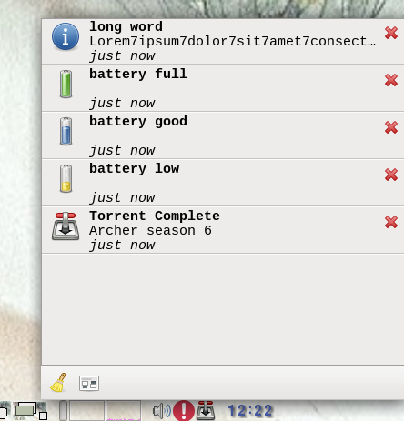

# ndnd #
ndnd - non disturbing notification deamon - collects all incoming
notifications and keeps them for later review.

## Goals ##

* do not be disturbed / interupted by "wifi was found", "wifi was lost" every 5
  sec. Not in a middle of an important presentation.
* privacy - keep all "xyz signed in", "signed off" off 
* history - all notification are there until you delete them

## Screenshots ##

## Source ##
[github](https://github.com/aanatoly/ndnd)
